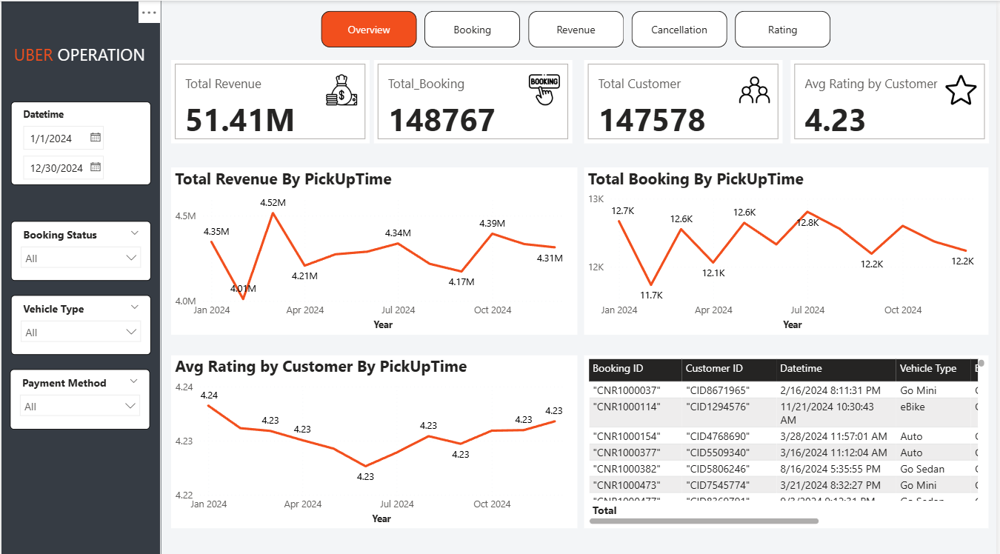

# Analysis-of-customer-behavior-and-operational-activities-Uber
# 🚗 Analysis of Customer Behavior and Operational Activities - Uber (2024)

## 📌 Context & Overview
Uber—a leading ride-hailing app—seeks to optimize operational efficiency and user experience management. Management has observed frequent fluctuations in trip cancellation rates and customer waiting times (VTAT/CTAT), alongside untapped revenue potential across different vehicle segments and time slots.

This project leverages an AI-generated synthetic dataset simulating realistic Uber ride-sharing operations for 2024 (150,000 records) to analyze operations, revenue, cancellation drivers, and customer segmentation using **Python**, **SQL**, and **Power BI**.

---

## 🎯 Core Objective
Leverage the Uber trip operations dataset to analyze operations, revenue, cancellation drivers, and customer segmentation, thereby formulating strategic recommendations to improve trip completion rates and optimize revenue.

---

## 📊 Dataset Summary
* **Size:** 150,000 rows x 21 columns
* **Key Features:**
  * **Customer & Identification:** `Customer ID`, `Booking ID`
  * **Time:** `Date`, `Time`
  * **Trip & Location Details:** `Vehicle Type`, `Pickup Location`, `Drop Location`, `Ride Distance`, `Booking Status`
  * **Financial & Payment:** `Booking Value`, `Payment Method`
  * **Operational & Time Metrics:** `Avg VTAT`, `Avg CTAT`
  * **Cancellation & Trip Failure:** `Cancelled Rides by Customer`, `Reason for cancelling by Customer`, `Cancelled Rides by Driver`, `Driver Cancellation Reason`, `Incomplete Rides`, `Incomplete Rides Reason`
  * **Feedback & Service Quality:** `Driver Ratings`, `Customer Rating`

---

## 🛠️ Data Pipeline & Exploratory Data Analysis (Python)

* **Null Values & Logic Check:** 8 columns contain no null values (`Date`, `Time`, `BookingID`, `BookingStatus`, `Customer ID`, `Vehicle Type`, `Pickup Location`, `Drop Location`). The remaining columns contain null values due to business logic (e.g., cancellation reasons are only present when a trip is canceled). No missing value issues exist within key columns based on `Booking Status` groups.
* **Feature Engineering:** Extracted time-related fields from `Date` and `Time`: `Datetime`, `Year`, `Month`, `Day`, `Weekday`, and `Weekend`.
* **Deduplication:** Identified 1,233 duplicate entries in `Booking ID`. Sorted the data in ascending order by `Datetime` and kept the most recent booking entry.
* **Cleaned Dataset:** **148,767 valid records** remain post-processing.

---

## 📈 Key Findings & Analytics (SQL)

### 🔴 Group 1: Operational Efficiency
* **Trip Completion Rate:** The overall success rate across the dataset is **62%**.
* **Vehicle Type Analysis:** Completion rates across vehicle types are roughly similar, with **Uber XL** having the highest completion rate. Cancellation rates hover around **25%** (highest on **Go Sedan**). Vehicle unavailability ("No Driver Found") ranges from 6% to 7% (highest on **Go Sedan** at **7.2%**).
* **Vehicle Allocation Time (Avg VTAT) & Wait Time (Avg CTAT):** Average driver dispatch time and customer waiting time remain relatively stable throughout the day. However, trips cancelled by customers exhibit a noticeably higher `Avg_VTAT` (~12.5 minutes) compared to completed trips (~8.5 minutes).
* **Top Shortage Hotspots:** Top 5 pickup routes with high demand but high "No Driver Found" rates are `Old Gurgaon`, `Pataudi Chowk`, `Paharganj`, `Greater Noida`, and `Vinobapuri`.

### 💰 Group 2: Revenue & Demand Analysis
* **Total Revenue:** Revenue from completed trips amounted to **46,859,058 Rupees**, with auto-rickshaws (**Auto**) generating the highest revenue at **11,631,357 Rupees**.
* **Cost Per Kilometer:** Average cost per kilometer (`Booking Value / Ride Distance`) is similar across vehicle types (~19.5 to 19.7 Rupees/km), indicating no significant price differentiation between standard and premium segments.
* **Preferred Payment:** **UPI** is the most preferred payment method for high-value bookings (above average).

### 🔍 Group 3: Root Cause & Experience Analysis
* **Customer Cancellation Reasons:** Wrong address, change of plans, driver not moving towards pickup location, driver asked to cancel, and AC not working.
* **Driver Cancellation Reasons:** Customer-related issues, customer coughing/sick, personal & car-related issues, and exceeding passenger capacity.
* **Incomplete Rides Reasons:** Customer Demand, Vehicle Breakdown, or Other Issue.
* **Rating Correlation:** Pearson correlation between `Avg VTAT` and `Customer Rating` is **-0.004**, indicating no linear relationship. The time spent waiting for vehicle dispatch does not directly affect the customer's final satisfaction rating.

### 🕒 Group 4: Time-Series & Loyalty Analysis
* **Peak Hours & Days:** **5:00 PM to 7:00 PM** (17:00–19:00) is the peak window for booking demand and also experiences the highest frequency of "No Driver Found" instances. Demand remains consistent across all weekdays.
* **Customer Segmentation:** The majority of users fall under "New / Low Value" (146,704 customers), while "Regular" has 869 and "Loyal Customer" has only 5.
* **Mass Cancellation Check:** No customer exhibited mass cancellation behavior (canceling more than two consecutive trips).

---

## 🖼️ Power BI Dashboard Overview
An interactive Power BI Dashboard was developed to visualize overall operations, revenue trends, booking statuses, cancellation metrics, and customer rating distributions.

 *(Power BI Operational Dashboard View)*

---

## 💡 Business Recommendations

### 1. Solutions to Improve Completion Rates

#### A. Driver Matching & Supply Management
* **Driver Relocation & Supply Dispatch at Hotspots:** Implement a Dynamic Incentive policy (per-trip bonuses) for drivers navigating to heavy shortage areas such as `Old Gurgaon`, `Pataudi Chowk`, `Paharganj`, `Greater Noida`, and `Vinobapuri`. Trigger real-time Heatmap Alerts on the driver app during the peak window (17:00 – 19:00) to concentrate supply.
* **Matching Algorithm Optimization:** Data reveals that `Avg_VTAT` for customer-cancelled rides is noticeably higher (~12.5 minutes compared to ~8.5 minutes for completed rides). The initial driver dispatch radius should be capped to reduce VTAT, preventing long-distance matches that lead to driver non-movement or requests for customer cancellations.

#### B. Mitigation of Customer & Driver Cancellations
* **Address Pickup Location Issues ("Wrong Address"):** Integrate an Auto-Suggest Pickup Snap feature and mandate visual confirmation from the customer before placing a ride request to mitigate this top cancellation cause.
* **Penalize Inactive Drivers / Forced Cancellations:** Implement automatic penalties and credit score reductions for drivers who accept rides but remain stationary ("Driver not moving") or prompt customers to cancel ("Driver asked to cancel").
* **Transport Policies & Quality Standards:** Add a passenger count selector in the app to prevent driver rejections due to exceeding capacity limits. Establish regular AC inspection protocols for vehicles (especially Go Sedan and Premier) as "AC not working" is a frequent reason for cancellation.

### 2. Solutions to Optimize Revenue

#### A. Segment-Based Price Restructuring (Dynamic Pricing Model)
* **Price Differentiation Across Vehicle Tiers:** Currently, the average rate per kilometer exhibits negligible variation between Bike (19.56) and Premier Sedan / Uber XL (19.64 – 19.7). This underutilizes the potential yield of premium and larger vehicle segments.
  * *Proposal:* Increase the base fare and per-kilometer rate for Premier Sedan and Uber XL while maintaining competitive entry pricing for Auto and Bike. This will raise take-rates per trip in premium tiers without dampening overall demand.
* **Smart Surge Pricing:** Apply marginal dynamic fare increases during the peak hours of 17:00 – 19:00. The revenue surplus directly boosts top-line earnings while incentivizing drivers to stay online, thereby suppressing "No Driver Found" rates.

#### B. Payment Optimization & High-Value Customer Activation
* **Promote UPI Integration & Co-Promotions:** Insights show that UPI is the predominant payment method for high-value transactions. Partner with UPI platforms and banks to offer cashback and discount campaigns on long-distance trips or Sedan/XL bookings to encourage higher basket sizes.
* **Loyalty & Retention Programs:** The "Loyal Customer" segment currently makes up a negligible fraction (5 customers), while "New / Low Value" constitutes the vast majority. Build a UberRewards / Membership Tier scheme with redeemable points and vouchers to convert low-frequency users into loyal customers, increasing Customer Lifetime Value (LTV).

---
